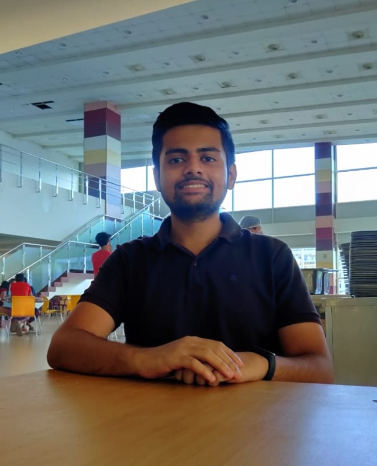

Hello There,

I am Rohit Bhardwaj. 

Currently, interning as a Business Analyst at [Verloop, Bangalore](https://verloop.io/), where I work with the Machine Learning Team.
The focus here is to automate customer support for businesses with Natural Language Processing. 

You can find me exploring the world of data and tech in my free-time.
 
*I believe that tech is at its best when it brings people together to solve issues for mankind to excel and shatter barriers and limitations which stood in its journey.*

In retrospect of my free time, I read books that help me think (although they make me sleepy too :P). At present, I am reading Ikigai - *The Japanese Secret to a Long and Happy Life*. 

A small request from you. 
Please don't be a silent reader and do connect with me on the links provided in the endnote. Suggestions, reviews, edits, and opinions are always welcome!

Until then,
**Carpe Diem!**
